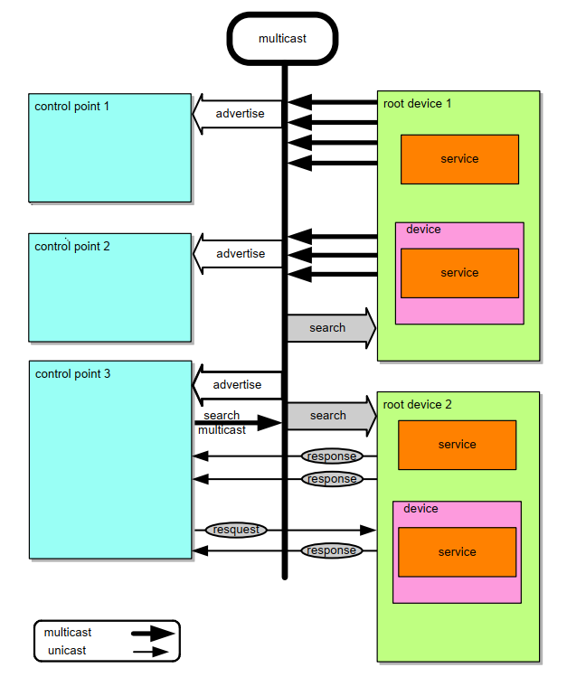
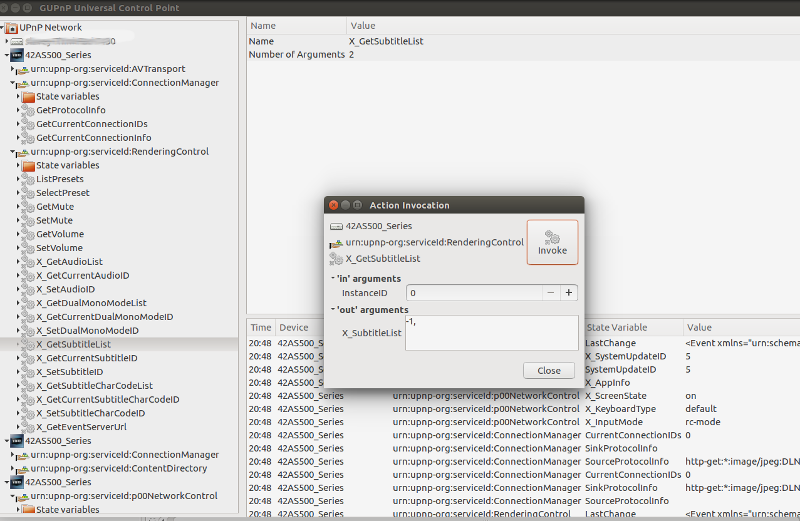

UPnP
====

Introduction
------------

A C++ library for managing UPnP devices and services using the Sming framework.

`Universal Plug and Play (UPnP) <https://en.wikipedia.org/wiki/Universal_Plug_and_Play>`__ *is a set of networking protocols
that permits networked devices, such as personal computers, printers, Internet gateways, Wi-Fi access points and mobile devices
to seamlessly discover each other's presence on the network and establish functional network services for data sharing,
communications, and entertainment.* (Wikipedia)

UPnP provides a set of standards which allows user applications (*Control Points* such as a mobile phone App.)
to discover and control embedded *devices* through standardised *services*.

Please refer to the official
`UPnP Device Architecture version 2.0 <http://upnp.org/specs/arch/UPnP-arch-DeviceArchitecture-v2.0.pdf>`__
for further details.

Background
----------

There are various open source UPnP libraries available, however we have a very specific
set of requirements which none of them can really meet.

If (like me) you're only dimly aware of UPnP and how it works, researching the
requirements is an important first step and in itself is time consuming.

What we'd really like is a simple API which lets us throw together a fully UPnP
compliant solution in the time it takes to drink a cup of coffee, with only a basic
knowledge of how it all works.

The ESP8266 is a 'Class II IoT Device'
   This classification is from `RFC7228: Terminology for Constrained-Node Networks <https://tools.ietf.org/html/rfc7228>`__,
   and considers the resources available for an embedded device.

   Basically, it *can't* run Linux but it *can* support IP networking.

   Whilst the ESP32 is 'less constrained', it's still class II and without care and
   attention to framework (and application) design all that extra RAM and horsepower
   will rapidly disappear.

UPnP (and SSDP) is just UDP, TCP, XML and JSON, so what's the problem?
   True, you can just throw together a custom solution which implements the various protocols
   and works OK. But like everything to do it properly takes time and effort.

   If you want it to be reliable and behave like a good neighbour then sticking to the
   standards is important:

   -  Be nice, don't flood the network with search requests
   -  But at the same time UDP is 'unreliable' so we should repeat messages
   -  How to listen to SSDP broadcasts without hanging the system

What's this about XML? Why can't we just use JSON?
   One of the advantages of `JSON <https://en.wikipedia.org/wiki/JSON>`__ is it's compact, human-friendly format.
   `XML <https://en.wikipedia.org/wiki/XML>`__ is less so, but it is more structured
   and well-suited for machine-to-machine information transfer.

   It's a core part of UPnP. See `UPnP Resouces <https://openconnectivity.org/developer/specifications/upnp-resources/upnp>`__.

   One of the many cool things about XML is `XSLT <https://en.wikipedia.org/wiki/XSLT>`__,
   which lets us easily convert existing XML documents into any format we like.
   The tools to do this are readily available; we can perform these transformations
   in a web browser, for example, hence the wealth of online tools to do just this.

   We can also use the published `Schema <https://en.wikipedia.org/wiki/XML_schema>`__
   to ensure strict standards compliance.

How do we deal with XML on a memory-constrained device?
   For very simple devices it's not an issue, but larger sets of description information
   will need to be handled in small chunks and assembled before it gets sent out.
   We want our classes to take care of all this transparently.

   If we want to discover other networked devices and control them, we'll also
   need to parse the XML data in a similar way.

   -  `Tiny XML-2 <https://github.com/leethomason/tinyxml2>`__ is a very popular library.
      It's a `DOM parser <https://en.wikipedia.org/wiki/Document_Object_Model>`__ so memory
      consumption is likely to be an issue.
   -  `Micro XPath <https://github.com/tmittet/microxpath>`__ is tiny, perhaps a little too simple though
   -  `Expat <https://github.com/libexpat/libexpat>`__ is a
      `SAX parser <https://en.wikipedia.org/wiki/Simple_API_for_XML>`__ written in C,
      could be just the ticket.

   `What XML parser should I use in C? <https://stackoverflow.com/questions/9387610/what-xml-parser-should-i-use-in-c>`__.

Most of the UPnP libraries are for Linux or Windows
   The `OSGi Alliance <https://www.osgi.org/>`__ provides a *dynamic module system* for java which includes
   many good design ideas and a great deal of useful information, such as:

   -  `Why is Modularity so Important? <https://www.osgi.org/developer/modularity/>`__
   -  `Architecture <https://www.osgi.org/developer/architecture/>`__, see list at bottom for references to the various
      open-source implementations.
   -  `OSGi Compendium Release 7 <https://osgi.org/javadoc/osgi.cmpn/7.0.0/>`__, see *org.osgi.service.upnp* package

   There are a couple of C/C++ frameworks which implemenent the OSGi specifications:

   -  `Apache Celix <https://github.com/apache/celix>`__
   -  `C++ Micro Services <https://github.com/CppMicroServices/CppMicroServices>`__

   Others:

   -  `gUPnP <https://gitlab.gnome.org/GNOME/gupnp-av>`__ object-oriented framework in C.

   Curiously, I've failed to turn up anything for FreeRTOS.

   I should probably mention Microsoft as they're the ones who created UPnP in the first place!
   See `UPnP APIs <https://docs.microsoft.com/en-us/windows/win32/upnp/universal-plug-and-play-start-page>`__.

Good integration with the Sming framework
   I like `Arduino-upnp <https://github.com/dannybackx/arduino-upnp>`__, it's a good approach and
   has some really great ideas. So if any of this library seems familiar that'll be why!

In the end I decided to just build something from scratch.
These are the specific areas I wanted to address:

Support for existing Sming applications
   You already have an embedded device but want to make it accessible via UPnP services.
   That means we want a lightweight layer which is easily added on top.

Be careful with RAM
   We don't want to waste RAM keeping track of state and other information which is already
   available elsewhere.

   Instead of keeping lists of services or devices we use an abstract enumerator.
   For example, a lighting controller may track the state of dozens or hundreds of lights,
   so the overhead of creating an object instance for each one is best avoided.

   Also, there is a considerably amount of UPnP configuration information but it
   can be stored in Flash and only read out when actually required.

Classes
-------

An application implements their devices and services using these provided base classes.

DeviceHost
   Implements SSDP discovery and notification supporting multiple root devices.
   The :library:`SSDP` library handles the protocol details.

Device
   All devices are implemented using this base class, including root devices.
   A common example of a root device is a Television, with separate (embedded) devices
   controlling subsystems such as sound, vision, networking, etc.

   Sming in a TV, now there's an idea...

Service
   A service implements actions and manages state to control a device.
   Like when a REST request asks for a light to be turned on, it'll be a service that performs the
   action and tracks state.
   The advantage with UPnP is that services are self-documented. You can explore this using
   various :ref:`upnp_tools`.

Item
   All UPnP classes are implemented using the *Item* class template, which allows them to be efficiently
   enumerated as a linked list. Class templates are ideal because they avoid the complication
   of dynamic type casting and generate efficient code.

List
   A singly-linked list of items, such as devices or services.

Features
--------

Discovery
   UPnP requires a minimal amount of information exchange to advertise services,
   however device descriptions can be relatively large and therefore unsafe to
   manipulate in a limited RAM system.

   Sming's template streams are one possible solution to this problem.
   The IMPORT_FSTR feature allows applications to easily define their own
   descriptions (templates or otherwise). The alternative is to use SPIFFS,
   however when :issue:`Partition Tables <1676>` are supported this will provide
   the best of both worlds.

   However, the application should not normally need to do all this as the framework will,
   by default, enumerate device fields and build the device description information 'on the fly'.

Memory efficiency
   Much of the UPnP framework is concerned with discovery and notification, which requires a significant
   amount of configuration data. This data is obtained via callbacks as required which allows
   device and service implementations to fetch it from flash memory storage or create it on demand,
   thus saving on RAM.

   Using linked lists also avoids the need for separate RAM allocation and simpler enumeration.
   Applications are responsible for device and service memory allocation, but unless services need
   to be dynamically created or destroyed it's simplest to just create them statically.

Enumeration
   One way to manage lists of many objects is to implement an enumerator with a single
   Service class instance. Every call to ``enumerator.next()`` returns the same object
   instance but with its internal state updated.

   The main caveat to this approach is that if you need to keep hold of one these
   objects then you must make a copy; you cannot hold onto references. For this reason
   enumerators have a ``clone()`` method and objects have copy constructors.

.. _upnp_tools:

UPnP Tools
----------

Windows:

-  `Developer Tools for UPnP Technologies <https://www.meshcommander.com/upnptools>`__

Linux:

   Under Ubuntu Linux you can install `gupnp-tools`::

      sudo apt install gupnp-tools

   And then discover devices on the local network using the following command::

       gupnp-universal-cp

   You can also start a "software" smart bulb device and use it to test your control point application::

      gupnp-network-light
